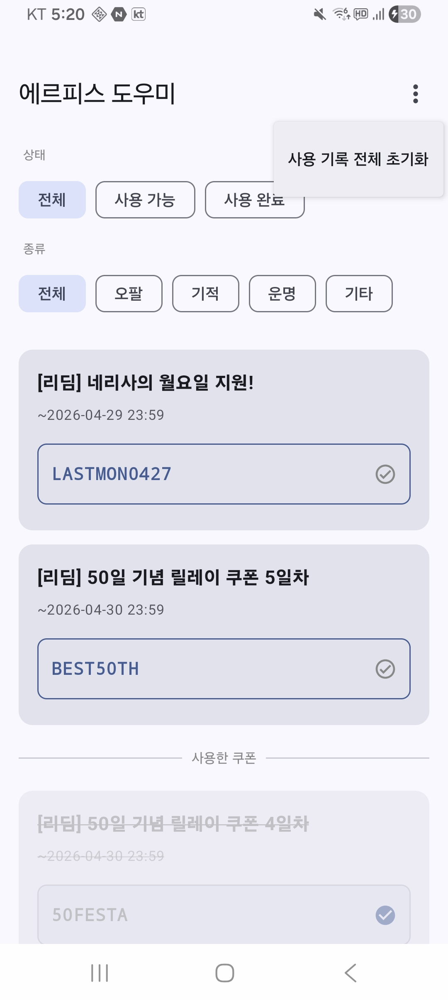
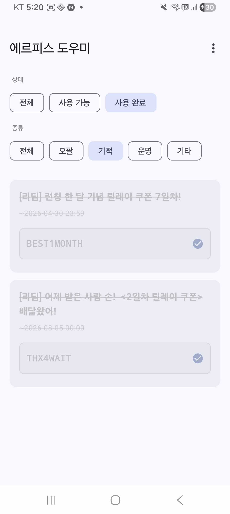

# 에르피스 도우미 (Ehrpis Helper)

모바일 게임 "에르피스"의 쿠폰 정보를 실시간으로 알려주는 안드로이드 앱입니다.

[](https://play.google.com/store/apps/details?id=com.loxa.ehrpishelper)

<br>

## 주요 기능

- **쿠폰 실시간 알림** — FCM 푸시로 신규 쿠폰 즉시 수신
- **쿠폰 목록 조회** — Firestore 실시간 구독, 유효/만료 상태 자동 분류
- **쿠폰 코드 복사** — 탭 한 번으로 클립보드 복사
- **사용 여부 체크** — Room DB에 기기 로컬 저장, 서버 전송 없음
- **필터링** — 상태(사용가능/사용완료) × 보상 종류(오팔/기적/운명/기타) 멀티셀렉트

<br>

## 스크린샷

| 쿠폰 목록                                                 | 필터                                            |
|-------------------------------------------------------|-----------------------------------------------|
|  |  |

<br>

## 기술 스택

| 분류 | 사용 기술 |
|---|---|
| 언어 | Kotlin |
| UI | Jetpack Compose + Material 3 |
| 아키텍처 | Clean Architecture + MVVM + Hilt DI |
| 비동기 | Kotlin Coroutines + Flow |
| 상태관리 | StateFlow + sealed interface UiState |
| 로컬 DB | Room |
| 리모트 DB | Firebase Firestore (callbackFlow 실시간 구독) |
| 푸시 알림 | Firebase Cloud Messaging (FCM) |
| 이미지 | Coil |
| 네비게이션 | Compose Navigation + kotlinx.serialization (type-safe routes) |

<br>

## 아키텍처

```
presentation/
  coupon/
    CouponScreen.kt       ← Compose UI
    CouponViewModel.kt    ← StateFlow + CouponUiState
    CouponFilter.kt
  navigation/
    AppNavHost.kt
    Routes.kt

domain/
  model/Coupon.kt
  repository/             ← 인터페이스
  usecase/                ← GetCoupons / ToggleUsage / ClearAll

data/
  repository/
    CouponRepositoryImpl.kt     ← Firestore callbackFlow
    UsedCouponRepositoryImpl.kt
  local/
    dao/UsedCouponDao.kt
    db/AppDatabase.kt

di/   DatabaseModule, FirebaseModule, RepositoryModule
fcm/  EhrpisMessagingService
```

<br>

## 빌드 설정

### 요구 사항
- JDK 17
- `google-services.json` (Firebase 프로젝트에서 발급)

### 실행 방법

1. 레포 클론
   ```bash
   git clone https://github.com/LoxaLovecarstone/Ehrpis-helper-android.git
   ```

2. `app/` 경로에 `google-services.json` 배치

3. Android Studio에서 빌드 및 실행

> 릴리스 빌드 시 `app/build.gradle.kts`의 `signingConfigs` 설정이 추가로 필요합니다.

<br>

## FCM 데이터 페이로드

```json
{
  "route": "coupon_list",
  "click_action": "OPEN_COUPON_LIST",
  "feed_id": "7508947",
  "coupons": "GIFTS0406",
  "expiry_end": "2026-04-08 23:59",
  "reward_types": "[\"오팔\", \"기적의 그림자\"]",
  "link": "https://game.naver.com/lounge/Ehrpis/board/detail/7508947"
}
```

`reward_types`는 복수 항목이 가능한 JSON 배열을 직렬화한 문자열입니다. 가능한 값: `오팔` / `기적의 그림자` / `운명의 그림자` / `기타`

FCM 토픽: `coupons`

<br>

## 개인정보처리방침

[https://loxalovecarstone.github.io/Ehrpis-helper-backend/privacy.html](https://loxalovecarstone.github.io/Ehrpis-helper-backend/privacy.html)

- FCM 토큰 외 개인정보 수집 없음
- 쿠폰 사용 기록은 기기 내부에만 저장
- 제3자 제공 없음
